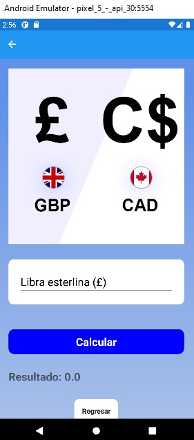

# Convertidor de divisas

## Integrantes
* Guachamín Daniel
* León Jeremy
* Yazán Cindy

## Acerca del proyecto

    

Se ha tomado como refencia el siguiente [Sitio Web](https://www.xe.com/es/) para realizar las distintas conversiones que contiene la aplicación 

* Este proyecto usa la herramienta [![XamarinForms][XamarinForms.com]][Xamarin-url]

## Capturas del proyecto 

    

* Convertidor Euro a Dolar

    

* Convertidor Libra Esterlina a Dolar Canadiense

    

* Convertidor Dolar Australiano a Yen Japonés

    

* Convertidor Dolar Neozelandés a Rupia India

    

* Convertidor Rublo Ruso a Franco Suizo

    

* Convertidor Dolar Hongkonés a Yuan

    

* Ejemplo de Conversión 

    

* APK Generada

A continuación, se comparte el enlace donde es posible descargar el [APK](https://epnecuador-my.sharepoint.com/:u:/g/personal/guillermo_guachamin_epn_edu_ec/EYRLb5cmHWtOk1V1FI0CmW8BP9EIc4GvFvW6JwgFNopGTg?e=L20V0N)

[XamarinForms.com]: https://img.shields.io/badge/Xamarin-800080?style=for-the-badge&logo=xamarin&logoColor=white
[Xamarin-url]: https://docs.microsoft.com/en-us/xamarin/xamarin-forms/
